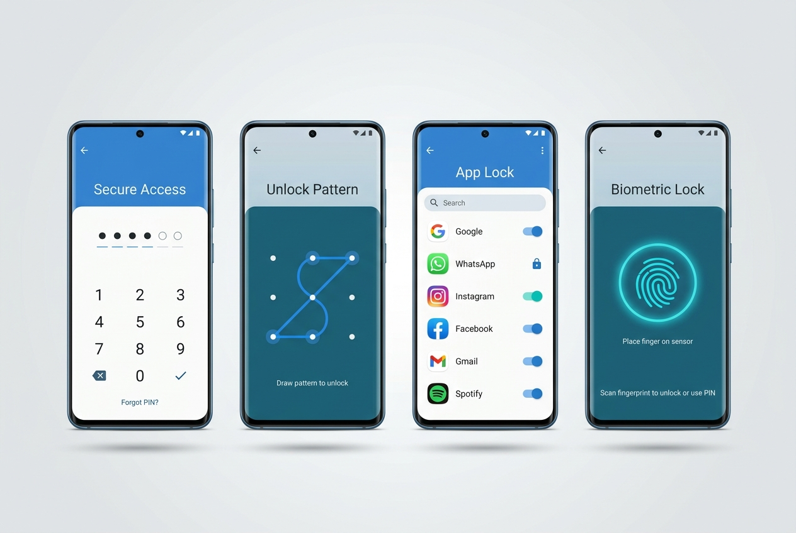
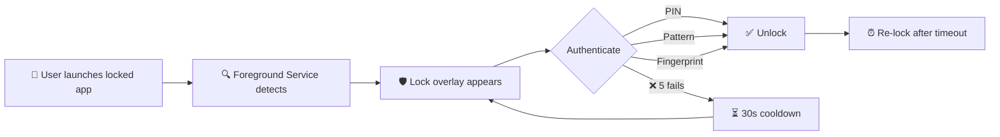

<div align="center">


# 🔐 AppLock Guard

### Secure Your Apps. Protect Your Privacy.

[](https://developer.android.com)
[](https://kotlinlang.org)
[](https://developer.android.com/jetpack/compose)
[](https://android-arsenal.com/api?level=26)
[](LICENSE)

**A native Android app lock application built with Kotlin & Jetpack Compose**
**that protects your apps with PIN, Pattern, or Fingerprint authentication.**

[📦 Download APK](#-download) · [📖 How It Works](#-how-it-works) · [🛠️ Build Guide](#-build-instructions)

---



</div>

---

## ✨ Key Features

<table>
<tr>
<td width="50%">

### 🔑 Multiple Lock Methods
- **PIN Lock** — 4–6 digit secure PIN code
- **Pattern Lock** — 3×3 gesture pattern
- **Fingerprint** — Biometric authentication

### 🛡️ Smart Protection
- **Background Monitoring** — Foreground service detects locked apps
- **Auto-start on Boot** — Protection resumes after restart
- **Re-lock Timeout** — Configurable auto re-lock timer

</td>
<td width="50%">

### 🚫 Anti-Bypass
- **Failed Attempt Lock** — 5 wrong attempts → 30s cooldown
- **Overlay Protection** — Lock screen overlays locked apps
- **Encrypted Storage** — EncryptedSharedPreferences for credentials

### 🎨 Premium Experience
- **Dark UI Theme** — Sleek dark mode with gradient accents
- **Material 3** — Modern design language
- **Smooth Animations** — Polished micro-interactions

</td>
</tr>
</table>

---

## 🏗️ Architecture

```
┌──────────────────────────────────────────────────────────────┐
│                     MVVM Architecture                        │
├──────────────────────────────────────────────────────────────┤
│                                                              │
│  ┌─────────────┐  ┌─────────────────┐  ┌─────────────────┐  │
│  │   UI Layer   │  │  Service Layer  │  │   Data Layer    │  │
│  │             │  │                 │  │                 │  │
│  │ Compose UI  │  │ Foreground Svc  │  │  Room Database  │  │
│  │ ViewModels  │  │ UsageStats Mgr  │  │  EncryptedPrefs │  │
│  │ Navigation  │  │ Boot Receiver   │  │  Repository     │  │
│  └──────┬──────┘  └────────┬────────┘  └────────┬────────┘  │
│         │                  │                    │           │
│         └──────────────────┴────────────────────┘           │
│                            │                                 │
│                    ┌───────┴───────┐                         │
│                    │   Utilities   │                         │
│                    │ Biometric API │                         │
│                    │ Crypto Helper │                         │
│                    │ Permission Mgr│                         │
│                    └───────────────┘                         │
└──────────────────────────────────────────────────────────────┘
```

---

## 🔒 How It Works



> **Step-by-step flow:**
> 1. **Setup** — User sets a master PIN or draws a pattern on first launch
> 2. **Select Apps** — Choose which apps to protect from the installed apps list
> 3. **Monitoring** — A foreground service polls `UsageStatsManager` every 500ms
> 4. **Lock Trigger** — When a locked app opens, the lock overlay appears
> 5. **Authenticate** — User unlocks via PIN, Pattern, or Fingerprint
> 6. **Re-lock** — After the configured timeout, the app locks again

---

## 📦 Download

### From Releases

> **Latest Release:** Check the [**Releases**](../../releases) page for the latest debug APK

### Build it yourself

See the [Build Instructions](#-build-instructions) below.

---

## 🛠️ Build Instructions

### Prerequisites

| Requirement | Version | Link |
|---|---|---|
| Android Studio | Hedgehog 2023.1.1+ | [Download](https://developer.android.com/studio) |
| JDK | 17 (bundled) | — |
| Android SDK | API 34 | — |
| Build Tools | 34.x | — |
| Device/Emulator | API 26+ | — |

### Quick Start

```bash
# 1. Clone the repository
git clone https://github.com/gauravpatoliya19/LOCK.git
cd LOCK

# 2. Build debug APK
# Windows
gradlew.bat assembleDebug

# macOS / Linux
./gradlew assembleDebug

# 3. Install on device
adb install app/build/outputs/apk/debug/app-debug.apk
```

### Build via Android Studio

1. **Open** → File → Open → select the `LOCK` folder
2. **Wait** for Gradle sync to complete
3. **Build** → Build Bundle(s) / APK(s) → Build APK(s)
4. **Locate** APK at `app/build/outputs/apk/debug/app-debug.apk`

<details>
<summary><strong>📦 Build a Signed Release APK</strong></summary>

#### 1. Generate a Signing Key

```bash
keytool -genkey -v -keystore applock-release.keystore \
  -alias applock -keyalg RSA -keysize 2048 -validity 10000
```

#### 2. Configure Signing in `app/build.gradle.kts`

```kotlin
android {
    signingConfigs {
        create("release") {
            storeFile = file("../applock-release.keystore")
            storePassword = "your_store_password"
            keyAlias = "applock"
            keyPassword = "your_key_password"
        }
    }

    buildTypes {
        release {
            signingConfig = signingConfigs.getByName("release")
        }
    }
}
```

#### 3. Build Release

```bash
# Windows
gradlew.bat assembleRelease

# macOS / Linux
./gradlew assembleRelease
```

Output: `app/build/outputs/apk/release/app-release.apk`

</details>

---

## ⚙️ Required Permissions

| Permission | Purpose | Android Setting |
|---|---|---|
| 📊 **Usage Access** | Detect foreground app | Settings → Security → Usage Access |
| 🪟 **Display Over Apps** | Show lock screen overlay | Settings → Apps → Special Access |
| 🔔 **Notifications** | "Protection active" indicator | Auto-prompted on Android 13+ |
| 🔄 **Boot Completed** | Restart service after reboot | Automatic |

---

## 🧪 Testing

```bash
# Unit tests
gradlew.bat test

# Instrumented tests (requires device/emulator)
gradlew.bat connectedAndroidTest
```

---

## 🧰 Tech Stack

<div align="center">

| Technology | Purpose |
|---|---|
|  | Primary language |
|  | Declarative UI |
|  | Design system |
|  | Local database |
|  | Annotation processing |
|  | Async operations |
|  | Fingerprint API |

</div>

---

## 📁 Project Structure

```
LOCK/
├── .github/
│   ├── assets/                          # Banner & screenshots
│   └── workflows/
│       └── build.yml                    # CI: Build debug APK
├── app/
│   ├── src/main/
│   │   ├── java/com/applock/guard/
│   │   │   ├── AppLockApplication.kt    # App initialization
│   │   │   ├── MainActivity.kt          # Entry point + navigation
│   │   │   ├── data/                    # Database, preferences, repository
│   │   │   ├── service/                 # Foreground service, boot receiver
│   │   │   ├── ui/                      # Compose screens + components
│   │   │   └── util/                    # Biometric, crypto, permission helpers
│   │   ├── res/                         # Resources (strings, themes, icons)
│   │   └── AndroidManifest.xml
│   └── build.gradle.kts                 # App-level build config
├── build.gradle.kts                     # Project-level config
├── settings.gradle.kts
├── gradle.properties
└── README.md
```

---

## 🤝 Contributing

Contributions are welcome! Here's how:

1. **Fork** this repository
2. **Create** a feature branch: `git checkout -b feature/amazing-feature`
3. **Commit** your changes: `git commit -m 'Add amazing feature'`
4. **Push** to the branch: `git push origin feature/amazing-feature`
5. **Open** a Pull Request

---

## ⭐ Star History

If you find this project useful, consider giving it a ⭐!

---

<div align="center">

**Made with ❤️ using Kotlin & Jetpack Compose**

[](https://github.com/gauravpatoliya19)

</div>
